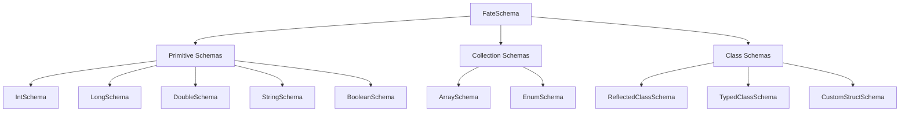

# Schema System

FateWeaver's schema system is the foundation that enables type-safe, efficient serialization of your robot data. Understanding schemas will help you optimize your logging and handle complex data structures effectively.

## What are Schemas?

A **schema** defines how FateWeaver serializes and deserializes objects of a specific type. Each schema:

- Describes the structure of your data
- Provides efficient binary encoding/decoding
- Embeds metadata for compatibility with visualization tools
- Ensures type safety at compile time

## Schema Types Overview

FateWeaver provides several categories of schemas:



## Primitive Schemas

Primitive schemas handle basic data types with optimized encoding:

### IntSchema

Serializes 32-bit signed integers.

=== "Kotlin"

    ```kotlin
    val encoderPositionChannel = FlightRecorder.createChannel(
        "Motors/Encoder/Position",
        IntSchema.INSTANCE
    )

    encoderPositionChannel.put(motor.currentPosition)
    ```

=== "Java"

    ```java
    FlightLogChannel<Integer> encoderPositionChannel =
        FlightRecorder.createChannel("Motors/Encoder/Position", IntSchema.INSTANCE);

    encoderPositionChannel.put(motor.getCurrentPosition());
    ```

### LongSchema

Serializes 64-bit signed integers, commonly used for timestamps.

=== "Kotlin"

    ```kotlin
    val timestampChannel = FlightRecorder.createChannel(
        "Timestamp",
        LongSchema.INSTANCE
    )

    timestampChannel.put(System.nanoTime())
    ```

=== "Java"

    ```java
    FlightLogChannel<Long> timestampChannel =
        FlightRecorder.createChannel("Timestamp", LongSchema.INSTANCE);

    timestampChannel.put(System.nanoTime());
    ```

### DoubleSchema

Serializes 64-bit floating-point numbers with full precision.

=== "Kotlin"

    ```kotlin
    val voltageChannel = FlightRecorder.createChannel(
        "Battery/Voltage",
        DoubleSchema.INSTANCE
    )

    voltageChannel.put(voltageSensor.voltage)
    ```

=== "Java"

    ```java
    FlightLogChannel<Double> voltageChannel =
        FlightRecorder.createChannel("Battery/Voltage", DoubleSchema.INSTANCE);

    voltageChannel.put(voltageSensor.getVoltage());
    ```

### StringSchema

Serializes UTF-8 strings with length prefixes for efficiency.

=== "Kotlin"

    ```kotlin
    val statusChannel = FlightRecorder.createChannel(
        "Robot/Status",
        StringSchema.INSTANCE
    )

    statusChannel.put("Autonomous Active")
    ```

=== "Java"

    ```java
    FlightLogChannel<String> statusChannel =
        FlightRecorder.createChannel("Robot/Status", StringSchema.INSTANCE);

    statusChannel.put("Autonomous Active");
    ```

### BooleanSchema

Serializes boolean values as single bytes.

=== "Kotlin"

    ```kotlin
    val limitSwitchChannel = FlightRecorder.createChannel(
        "Sensors/LimitSwitch",
        BooleanSchema.INSTANCE
    )

    limitSwitchChannel.put(limitSwitch.isPressed)
    ```

=== "Java"

    ```java
    FlightLogChannel<Boolean> limitSwitchChannel =
        FlightRecorder.createChannel("Sensors/LimitSwitch", BooleanSchema.INSTANCE);

    limitSwitchChannel.put(limitSwitch.isPressed());
    ```

## Collection Schemas

### ArraySchema<T>

Handles arrays of any supported type with length prefixes.

=== "Kotlin"

    ```kotlin
    val motorPowersSchema = ArraySchema(DoubleSchema.INSTANCE)
    val motorPowersChannel = FlightRecorder.createChannel(
        "Motors/Powers",
        motorPowersSchema
    )

    motorPowersChannel.put(doubleArrayOf(0.8, 0.6, 0.7, 0.9))
    ```

=== "Java"

    ```java
    ArraySchema<Double> motorPowersSchema = new ArraySchema<>(DoubleSchema.INSTANCE);
    FlightLogChannel<Double[]> motorPowersChannel =
        FlightRecorder.createChannel("Motors/Powers", motorPowersSchema);

    motorPowersChannel.put(new Double[]{0.8, 0.6, 0.7, 0.9});
    ```

!!! tip "Primitive Arrays"
    For primitive arrays (int[], double[], etc.), FateWeaver automatically boxes them. Consider using custom schemas for better performance with large arrays.

### EnumSchema<T>

Efficiently serializes enums using ordinal values.

=== "Kotlin"

    ```kotlin
    enum class AllianceColor { RED, BLUE }

    val allianceSchema = EnumSchema(AllianceColor::class.java)
    val allianceChannel = FlightRecorder.createChannel("Match/Alliance", allianceSchema)

    allianceChannel.put(AllianceColor.RED)
    ```

=== "Java"

    ```java
    enum AllianceColor { RED, BLUE }

    EnumSchema<AllianceColor> allianceSchema = new EnumSchema<>(AllianceColor.class);
    FlightLogChannel<AllianceColor> allianceChannel =
        FlightRecorder.createChannel("Match/Alliance", allianceSchema);

    allianceChannel.put(AllianceColor.RED);
    ```

## Class Schemas

Class schemas handle complex objects with multiple fields.

### ReflectedClassSchema<T>

Automatically generates schemas using Java reflection. This is the default for most classes.

=== "Kotlin"

    ```kotlin
    data class RobotConfig(
        val maxSpeed: Double,
        val wheelDiameter: Double,
        val trackWidth: Double,
        val gearRatio: Double
    )

    // FateWeaver automatically creates a ReflectedClassSchema
    val configChannel = FlightRecorder.createChannel("Robot/Config", RobotConfig::class.java)

    configChannel.put(RobotConfig(1.0, 4.0, 14.5, 1.5))
    ```

=== "Java"

    ```java
    public class RobotConfig {
        public final double maxSpeed;
        public final double wheelDiameter;
        public final double trackWidth;
        public final double gearRatio;

        public RobotConfig(double maxSpeed, double wheelDiameter,
                          double trackWidth, double gearRatio) {
            this.maxSpeed = maxSpeed;
            this.wheelDiameter = wheelDiameter;
            this.trackWidth = trackWidth;
            this.gearRatio = gearRatio;
        }
    }

    // FateWeaver automatically creates a ReflectedClassSchema
    FlightLogChannel<RobotConfig> configChannel =
        FlightRecorder.createChannel("Robot/Config", RobotConfig.class);

    configChannel.put(new RobotConfig(1.0, 4.0, 14.5, 1.5));
    ```

#### How Reflection Works

ReflectedClassSchema automatically:

1. **Discovers Fields**: Finds all public fields (and properties in Kotlin)
2. **Creates Schemas**: Recursively creates schemas for field types
3. **Handles Nested Objects**: Supports arbitrarily nested class structures
4. **Manages Collections**: Automatically handles Lists, Arrays, etc.

!!! warning "Limitations"
    - Only works with public fields
    - Cannot handle private fields without getters
    - May be slower than custom schemas for performance-critical code

### TypedClassSchema<T>

Enhanced version of ReflectedClassSchema that includes type information, 
activated by the `AS_TYPE` static field (Java) or companion object property (Kotlin).

=== "Kotlin"

    ```kotlin
    data class SensorReading(
        val timestamp: Long,
        val value: Double,
        val sensorId: String
    ) {
        companion object {
            const val AS_TYPE = "SensorReading"  // Triggers TypedClassSchema
        }
    }

    val sensorChannel = FlightRecorder.createChannel("Sensors/Reading", SensorReading::class.java)
    // Automatically uses TypedClassSchema because of AS_TYPE
    ```

=== "Java"

    ```java
    public class SensorReading {
        public static final String AS_TYPE = "SensorReading";  // Triggers TypedClassSchema

        public final long timestamp;
        public final double value;
        public final String sensorId;

        public SensorReading(long timestamp, double value, String sensorId) {
            this.timestamp = timestamp;
            this.value = value;
            this.sensorId = sensorId;
        }
    }

    FlightLogChannel<SensorReading> sensorChannel =
        FlightRecorder.createChannel("Sensors/Reading", SensorReading.class);
    // Automatically uses TypedClassSchema because of AS_TYPE
    ```

#### Benefits of AS_TYPE

- **Debugging**: Easier to identify data types in logs
- **Tooling**: Better support in analysis tools

### CustomStructSchema<T>

Provides complete control over serialization with custom encoding functions.

=== "Kotlin"

    ```kotlin
    data class Pose2d(val x: Double, val y: Double, val heading: Double)

    val customPoseSchema = CustomStructSchema<Pose2d>(
        type = "Pose2d",
        componentNames = listOf("x", "y", "heading"),
        componentSchemas = listOf(DoubleSchema.INSTANCE, DoubleSchema.INSTANCE, DoubleSchema.INSTANCE),
        encoder = { pose ->
            listOf(pose.x, pose.y, pose.heading)
        }
    )

    val poseChannel = FlightRecorder.createChannel("Robot/Pose", customPoseSchema)
    ```

=== "Java"

    ```java
    public class Pose2d {
        public final double x, y, heading;

        public Pose2d(double x, double y, double heading) {
            this.x = x; this.y = y; this.heading = heading;
        }
    }

    CustomStructSchema<Pose2d> customPoseSchema = new CustomStructSchema<>(
        "Pose2d",
        List.of("x", "y", "heading"),
        List.of(DoubleSchema.INSTANCE, DoubleSchema.INSTANCE, DoubleSchema.INSTANCE),
        pose -> List.of(pose.x, pose.y, pose.heading)
    );

    FlightLogChannel<Pose2d> poseChannel =
        FlightRecorder.createChannel("Robot/Pose", customPoseSchema);
    ```

#### Advanced Custom Schema Examples

**Data Transformation:**
=== "Kotlin"

    ```kotlin
    // Convert units during serialization
    val distanceSchema = CustomStructSchema<Double>(
        type = "Distance",
        componentNames = listOf("meters"),
        componentSchemas = listOf(DoubleSchema.INSTANCE),
        encoder = { inches -> listOf(inches * 0.0254) }  // Convert inches to meters
    )
    ```

=== "Java"

    ```java
    // Convert units during serialization
    CustomStructSchema<Double> distanceSchema = new CustomStructSchema<>(
        "Distance",
        List.of("meters"),
        List.of(DoubleSchema.INSTANCE),
        inches -> List.of(inches * 0.0254)  // Convert inches to meters
    );
    ```

**Selective Field Logging:**
=== "Kotlin"

    ```kotlin
    data class ComplexObject(
        val importantData: Double,
        val timestamp: Long,
        val debugInfo: String,      // Skip this
        val internalState: Any      // Skip this
    )

    val selectiveSchema = CustomStructSchema<ComplexObject>(
        type = "ImportantData",
        componentNames = listOf("data", "time"),
        componentSchemas = listOf(DoubleSchema.INSTANCE, LongSchema.INSTANCE),
        encoder = { obj ->
            listOf(obj.importantData, obj.timestamp)  // Only log important fields
        }
    )
    ```

=== "Java"

    ```java
    CustomStructSchema<ComplexObject> selectiveSchema = new CustomStructSchema<>(
        "ImportantData",
        List.of("data", "time"),
        List.of(DoubleSchema.INSTANCE, LongSchema.INSTANCE),
        obj -> List.of(obj.importantData, obj.timestamp)  // Only log important fields
    );
    ```

### TranslatedSchema<T, U>

A wrapper schema that converts objects from one type to another during serialization.
This is particularly useful for:

- **Legacy Classes**: Logging objects from libraries you can't modify
- **Type Adapters**: Converting between incompatible types
- **Wrapper Classes**: Unwrapping values before serialization
- **Simplified Serialization**: Converting complex types to simpler representations

`TranslatedSchema` takes objects of type `T`, converts them to type `U` using a translation function,
and then serializes them using the schema for type `U`.

#### Basic Usage

=== "Kotlin"

    ```kotlin
    // Example: You have a wrapper class but want to log the inner value
    data class Voltage(val value: Double)

    val voltageSchema = TranslatedSchema<Voltage, Double>(
        baseSchema = DoubleSchema.INSTANCE,
        toBase = { voltage -> voltage.value }
    )

    val voltageChannel = FlightRecorder.createChannel("Battery/Voltage", voltageSchema)
    voltageChannel.put(Voltage(12.6))  // Logs as 12.6 (double)
    ```

=== "Java"

    ```java
    // Example: You have a wrapper class but want to log the inner value
    public class Voltage {
        public final double value;
        public Voltage(double value) { this.value = value; }
    }

    TranslatedSchema<Voltage, Double> voltageSchema = new TranslatedSchema<>(
        DoubleSchema.INSTANCE,
        voltage -> voltage.value
    );

    FlightLogChannel<Voltage> voltageChannel =
        FlightRecorder.createChannel("Battery/Voltage", voltageSchema);
    voltageChannel.put(new Voltage(12.6));  // Logs as 12.6 (double)
    ```

#### Alternative Constructor

You can also construct `TranslatedSchema` by passing the target class directly:

=== "Kotlin"

    ```kotlin
    val voltageSchema = TranslatedSchema<Voltage, Double>(
        baseClass = Double::class.java,
        toBase = { voltage -> voltage.value }
    )
    // FateWeaver automatically finds/creates the schema for Double
    ```

=== "Java"

    ```java
    TranslatedSchema<Voltage, Double> voltageSchema = new TranslatedSchema<>(
        Double.class,
        voltage -> voltage.value
    );
    // FateWeaver automatically finds/creates the schema for Double
    ```

#### Advanced Examples

**Converting Library Types:**

=== "Kotlin"

    ```kotlin
    // Example: RoadRunner's Rotation2d to Double
    import com.acmerobotics.roadrunner.Rotation2d

    val rotationSchema = TranslatedSchema<Rotation2d, Double>(
        baseClass = Double::class.java,
        toBase = { rotation -> rotation.toDouble() }
    )

    val headingChannel = FlightRecorder.createChannel("Robot/Heading", rotationSchema)
    headingChannel.put(Rotation2d.exp(Math.PI / 2))  // Logs as 1.5707... (double)
    ```

=== "Java"

    ```java
    // Example: RoadRunner's Rotation2d to Double
    import com.acmerobotics.roadrunner.Rotation2d;

    TranslatedSchema<Rotation2d, Double> rotationSchema = new TranslatedSchema<>(
        Double.class,
        rotation -> rotation.toDouble()
    );

    FlightLogChannel<Rotation2d> headingChannel =
        FlightRecorder.createChannel("Robot/Heading", rotationSchema);
    headingChannel.put(Rotation2d.exp(Math.PI / 2));  // Logs as 1.5707... (double)
    ```

**Converting to Complex Types:**

=== "Kotlin"

    ```kotlin
    // Example: Convert a custom type to a data class with a registered schema
    data class MotorState(val power: Double, val position: Int, val velocity: Double)

    class Motor(/* ... */) {
        fun getPower(): Double = /* ... */
        fun getPosition(): Int = /* ... */
        fun getVelocity(): Double = /* ... */
    }

    val motorSchema = TranslatedSchema<Motor, MotorState>(
        baseClass = MotorState::class.java,
        toBase = { motor -> 
            MotorState(motor.getPower(), motor.getPosition(), motor.getVelocity())
        }
    )

    val motorChannel = FlightRecorder.createChannel("Motors/FrontLeft", motorSchema)
    motorChannel.put(frontLeftMotor)  // Converted to MotorState, then serialized
    ```

=== "Java"

    ```java
    // Example: Convert a custom type to a data class with a registered schema
    public class MotorState {
        public final double power;
        public final int position;
        public final double velocity;
        
        public MotorState(double power, int position, double velocity) {
            this.power = power;
            this.position = position;
            this.velocity = velocity;
        }
    }

    public class Motor {
        public double getPower() { /* ... */ }
        public int getPosition() { /* ... */ }
        public double getVelocity() { /* ... */ }
    }

    TranslatedSchema<Motor, MotorState> motorSchema = new TranslatedSchema<>(
        MotorState.class,
        motor -> new MotorState(motor.getPower(), motor.getPosition(), motor.getVelocity())
    );

    FlightLogChannel<Motor> motorChannel =
        FlightRecorder.createChannel("Motors/FrontLeft", motorSchema);
    motorChannel.put(frontLeftMotor);  // Converted to MotorState, then serialized
    ```

**Enum to String Conversion:**

=== "Kotlin"

    ```kotlin
    enum class DriveMode { FIELD_CENTRIC, ROBOT_CENTRIC, AUTO }

    val driveModeSchema = TranslatedSchema<DriveMode, String>(
        baseClass = String::class.java,
        toBase = { mode -> mode.name }
    )

    val modeChannel = FlightRecorder.createChannel("Drive/Mode", driveModeSchema)
    modeChannel.put(DriveMode.FIELD_CENTRIC)  // Logs as "FIELD_CENTRIC" (string)
    ```

=== "Java"

    ```java
    enum DriveMode { FIELD_CENTRIC, ROBOT_CENTRIC, AUTO }

    TranslatedSchema<DriveMode, String> driveModeSchema = new TranslatedSchema<>(
        String.class,
        mode -> mode.name()
    );

    FlightLogChannel<DriveMode> modeChannel =
        FlightRecorder.createChannel("Drive/Mode", driveModeSchema);
    modeChannel.put(DriveMode.FIELD_CENTRIC);  // Logs as "FIELD_CENTRIC" (string)
    ```

#### When to Use TranslatedSchema

| Situation | Use TranslatedSchema? | Alternative |
|-----------|----------------------|-------------|
| Wrapper class with single value | ✅ Yes - clean and simple | CustomStructSchema |
| Library type you can't modify | ✅ Yes - perfect fit | CustomStructSchema |
| Need to transform data | ✅ Yes - if converting to existing type | CustomStructSchema for custom format |
| Complex multi-field conversion | ⚠️ Maybe - consider CustomStructSchema | CustomStructSchema |
| Simple type unwrapping | ✅ Yes - most elegant solution | Direct field access |

#### Performance Considerations

- **Translation Overhead**: The translation function is called for every object logged
- **Schema Reuse**: The base schema is reused, so no schema creation overhead
- **Keep It Simple**: Translation functions should be fast and lightweight
- **Avoid Allocations**: Try to avoid creating temporary objects in the translation function when possible

!!! tip "Combining with Schema Registry"
    You can register `TranslatedSchema` instances globally to use them automatically:
    
    ```kotlin
    FateSchema.registerSchema(Voltage::class.java, voltageSchema)
    
    // Now all Voltage channels automatically use the translation
    val channel = FlightRecorder.createChannel("Battery/Voltage", Voltage::class.java)
    ```

## Schema Registry

The schema registry provides global schema management and reuse.

### Automatic Registration

When you create a channel for a class, FateWeaver automatically:

1. Checks if a schema is already registered for that class
2. If not, creates an appropriate schema (Reflected or Typed based on AS_TYPE)
3. Registers the schema for future use
4. Returns a channel using the registered schema

### Manual Registration

You can register custom schemas to override the defaults:

=== "Kotlin"

    ```kotlin
    // Define once
    val optimizedPoseSchema = CustomStructSchema<Pose2d>(
        type = "Pose2d",
        componentNames = listOf("x", "y", "theta"),
        componentSchemas = listOf(DoubleSchema.INSTANCE, DoubleSchema.INSTANCE, DoubleSchema.INSTANCE),
        encoder = { pose -> listOf(pose.position.x, pose.position.y, pose.heading.toDouble()) }
    )

    // Register globally
    FateSchema.registerSchema(Pose2d::class.java, optimizedPoseSchema)

    // All future channels automatically use your custom schema
    val poseChannel1 = FlightRecorder.createChannel("Robot/Pose", Pose2d::class.java)
    val poseChannel2 = FlightRecorder.createChannel("Target/Pose", Pose2d::class.java)
    // Both use optimizedPoseSchema automatically!
    ```

=== "Java"

    ```java
    // Define once
    CustomStructSchema<Pose2d> optimizedPoseSchema = new CustomStructSchema<>(
        "Pose2d",
        List.of("x", "y", "theta"),
        List.of(DoubleSchema.INSTANCE, DoubleSchema.INSTANCE, DoubleSchema.INSTANCE),
        pose -> List.of(pose.position.x, pose.position.y, pose.heading.toDouble())
    );

    // Register globally
    FateSchema.registerSchema(Pose2d.class, optimizedPoseSchema);

    // All future channels automatically use your custom schema
    FlightLogChannel<Pose2d> poseChannel1 =
        FlightRecorder.createChannel("Robot/Pose", Pose2d.class);
    FlightLogChannel<Pose2d> poseChannel2 =
        FlightRecorder.createChannel("Target/Pose", Pose2d.class);
    // Both use optimizedPoseSchema automatically!
    ```

### Best Practices for Registration

1. **Register Early**: Set up schemas in your OpMode's `init()` method
2. **One Place**: Keep all schema registrations in a single location
3. **Document Choices**: Comment why you chose custom schemas over defaults

=== "Kotlin"

    ```kotlin
    abstract class BaseOpMode : OpMode() {
        override fun init() {
            setupSchemas()
            initHardware()
        }

        private fun setupSchemas() {
            // Register all custom schemas here
            FateSchema.registerSchema(Pose2d::class.java, OPTIMIZED_POSE_SCHEMA)
            FateSchema.registerSchema(PoseVelocity2d::class.java, VELOCITY_SCHEMA)
            FateSchema.registerSchema(RobotState::class.java, STATE_SCHEMA)
        }

        companion object {
            private val OPTIMIZED_POSE_SCHEMA = CustomStructSchema<Pose2d>(/* ... */)
            private val VELOCITY_SCHEMA = CustomStructSchema<PoseVelocity2d>(/* ... */)
            private val STATE_SCHEMA = CustomStructSchema<RobotState>(/* ... */)
        }
    }
    ```

=== "Java"

    ```java
    public abstract class BaseOpMode extends OpMode {
        @Override
        public final void init() {
            setupSchemas();
            initHardware();
        }

        private void setupSchemas() {
            // Register all custom schemas here
            FateSchema.registerSchema(Pose2d.class, OPTIMIZED_POSE_SCHEMA);
            FateSchema.registerSchema(PoseVelocity2d.class, VELOCITY_SCHEMA);
            FateSchema.registerSchema(RobotState.class, STATE_SCHEMA);
        }

        protected abstract void initHardware();

        private static final CustomStructSchema<Pose2d> OPTIMIZED_POSE_SCHEMA =
            new CustomStructSchema<>(/* ... */);
        private static final CustomStructSchema<PoseVelocity2d> VELOCITY_SCHEMA =
            new CustomStructSchema<>(/* ... */);
        private static final CustomStructSchema<RobotState> STATE_SCHEMA =
            new CustomStructSchema<>(/* ... */);
    }
    ```

## Schema Selection Guide

Choose the right schema type for your needs:

| Use Case                            | Recommended Schema         | Reason                     |
|-------------------------------------|----------------------------|----------------------------|
| Simple values (int, double, string) | Primitive Schemas          | Optimal performance        |
| Arrays of primitives                | ArraySchema                | Built-in support           |
| Enums                               | EnumSchema                 | Efficient ordinal encoding |
| Simple data classes                 | ReflectedClassSchema       | Automatic, no setup        |
| Polymorphic logging                 | TypedClassSchema (AS_TYPE) | Type information included  |
| Performance-critical                | CustomStructSchema         | Complete control           |
| Unit conversion                     | CustomStructSchema         | Transform during logging   |
| Selective logging                   | CustomStructSchema         | Choose which fields to log |

## Troubleshooting Schemas

### Common Issues

**"Cannot create schema for class"**
```kotlin
// Problem: Class has no public fields
data class PrivateFields(private val x: Int)

// Solution: Use CustomStructSchema or make fields public
data class PublicFields(val x: Int)
```

**"Unsupported field type"**
```kotlin
// Problem: Using unsupported types
data class BadClass(val lambda: () -> Unit)  // Functions not supported

// Solution: Use only supported types or CustomStructSchema
data class GoodClass(val value: Double)
```

**"Schema mismatch"**
```kotlin
// Problem: Changing schema after registration
FateSchema.registerSchema(MyClass::class.java, schemaV1)
// Later...
FateSchema.registerSchema(MyClass::class.java, schemaV2)  // Error!

// Solution: Register schemas once, early in initialization
```
