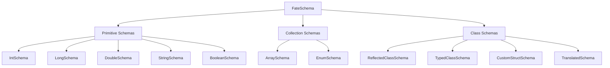

FateSchema.registerSchema(MyClass::class.java, schemaV1)
// Later...
FateSchema.registerSchema(MyClass::class.java, schemaV2)  // Error!

// Solution: Register schemas once, early in initialization
```

## Performance Tips

1. **Use Primitive Schemas** for simple types - they're the fastest
2. **Cache Schema References** if creating channels repeatedly
3. **Register Schemas Early** to avoid reflection overhead during logging
4. **Prefer CustomStructSchema** over reflection for performance-critical paths
5. **Keep Translation Functions Simple** when using TranslatedSchema
6. **Avoid Nested Collections** when possible (e.g., `Array<Array<Double>>`)

## Best Practices

1. **Start Simple**: Use automatic schemas (ReflectedClassSchema) until you need optimization
2. **Profile First**: Measure before optimizing with custom schemas
3. **Document Custom Schemas**: Explain why you chose a custom approach
4. **Test Serialization**: Verify your custom encoders work correctly
5. **Version Your Schemas**: Consider future compatibility when designing schemas
6. **Use AS_TYPE**: Add type information for better debugging and tooling support
# Schema System

FateWeaver's schema system is the foundation that enables type-safe, efficient serialization of your robot data. Understanding schemas will help you optimize your logging and handle complex data structures effectively.

## What are Schemas?

A **schema** defines how FateWeaver serializes and deserializes objects of a specific type. Each schema:

- Describes the structure of your data
- Provides efficient binary encoding/decoding
- Embeds metadata for compatibility with visualization tools
- Ensures type safety at compile time

## Schema Types Overview

FateWeaver provides several categories of schemas:



## Quick Links

- **[Primitive Schemas](primitive-schemas.md)** - Simple types like int, double, string, boolean
- **[Collection Schemas](collection-schemas.md)** - Arrays and enums
- **[Class Schemas](class-schemas.md)** - Complex objects with multiple fields
- **[Schema Registry](registry.md)** - Global schema management and reuse
- **[Selection Guide](guide.md)** - Help choosing the right schema and troubleshooting

